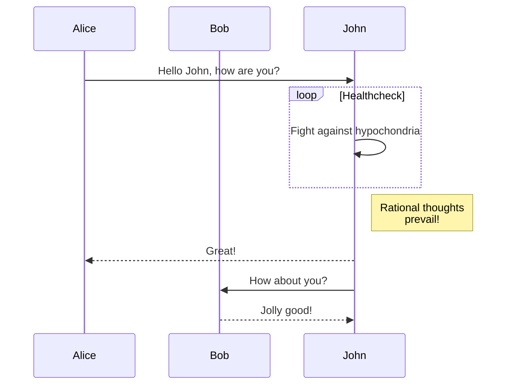
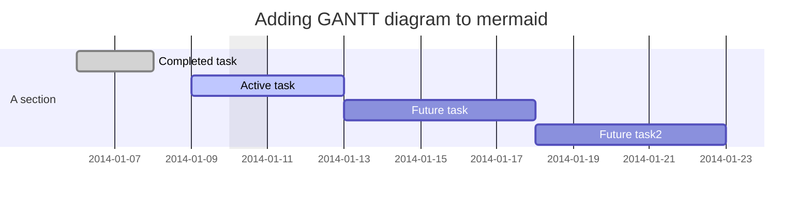
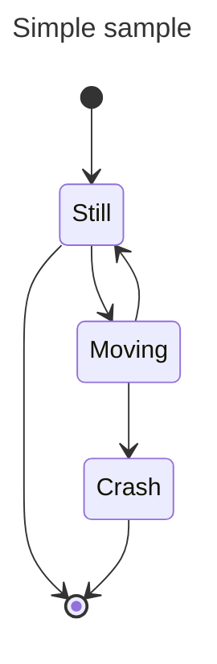
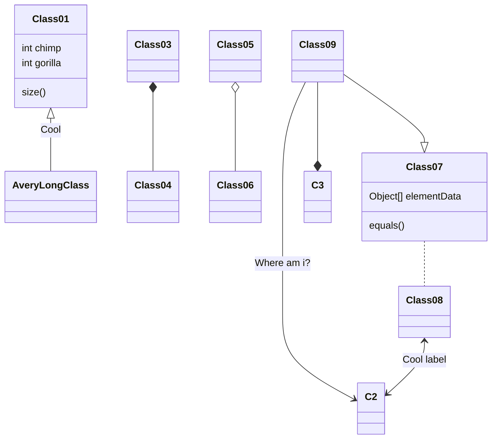
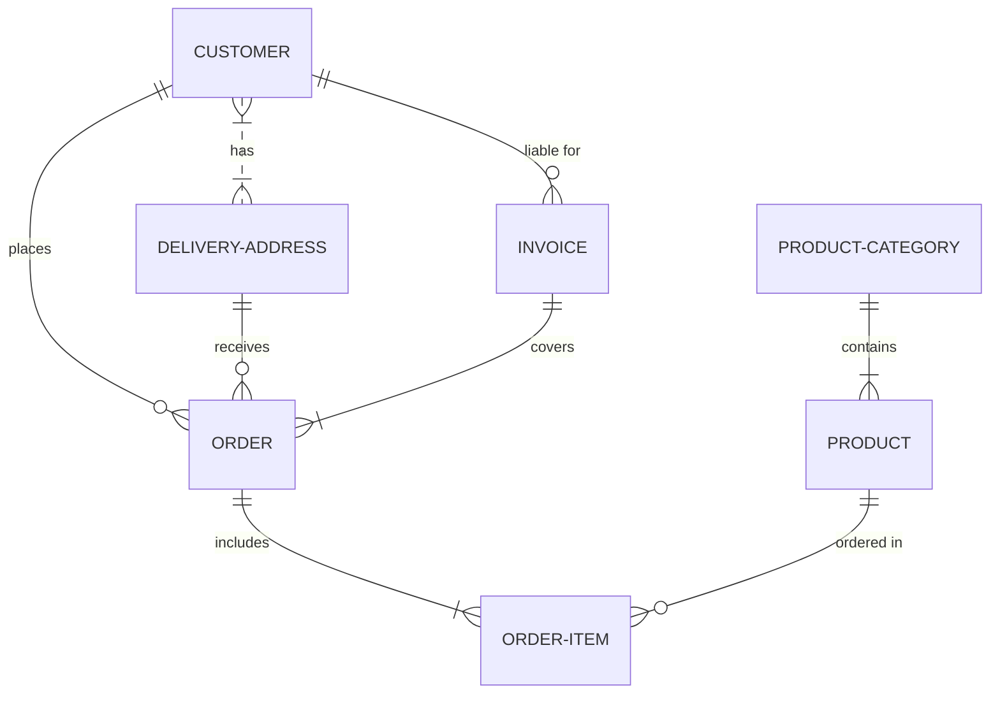
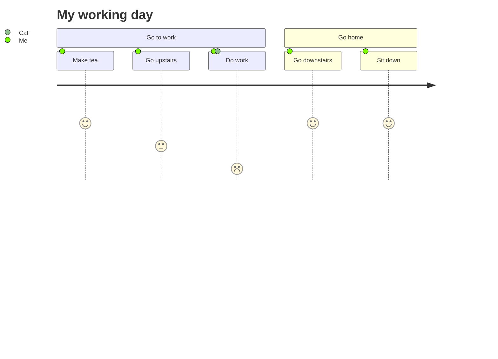
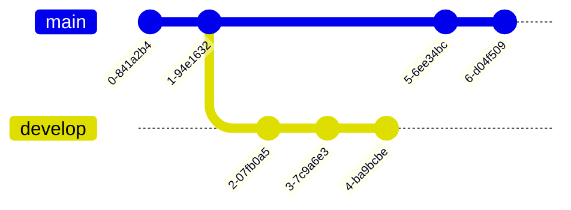
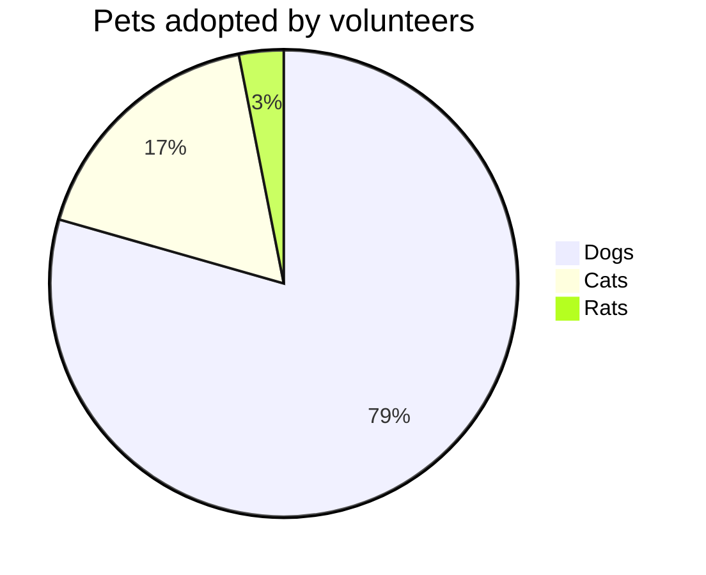
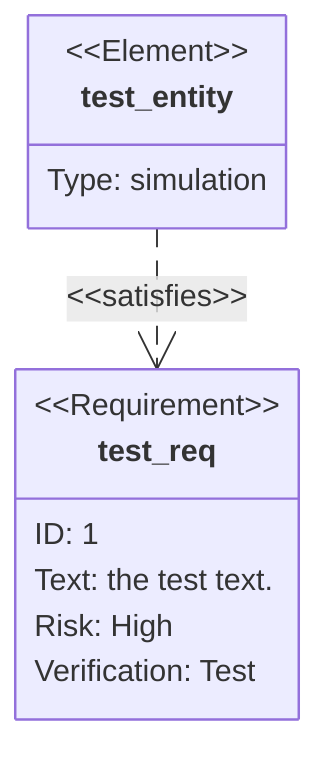

Heading
=======

Sub-heading
-----------

# Alternative heading

## Aternative sub-heading

Paragraphs are separated 
by a blank line.

Two spaces at the end of a line  produce a line break.

Text attributes _italic_, **bold**, `monospace`.

Horizontal rule:

---

``` javascript
const sentence = 'A beautiful day in codeland';

const scream = (string) => {
	return string.toUpperCase();
}

console.log(scream(sentence));

```

Bullet lists nested within numbered list:

  1. fruits
     * apple
     * banana
  2. vegetables
     - carrot
     - broccoli
    
  A [link](http://example.com).


> Markdown uses email-style
characters for blockquoting.
>
> Multiple paragraphs need to be prepended individually.

Most inline <abbr title="Hypertext Markup Language">HTML</abbr> tags are supported.

---

# Using Mermaid:
## Diagrams
Flowchart:

Sequence diagram:

Gantt diagram:

State diagram:

Class diagram:

Entity relationship diagram:

User jouney diagram:

Git graph:

Pie chart:

Requirement diagram

